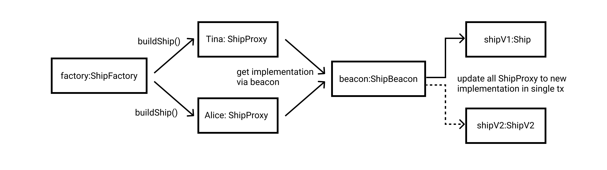

# BeaconShip

this is an example for BeaconProxy and the source comes from [DEVELOP AN UPGRADEABLE SMART CONTRACT USING UPGRADEABLE BEACON AND FACTORY - YouTube](https://www.youtube.com/watch?v=2acgw589jRM).



## Usage

```bash
# install all dependencies, please use node 16
$ npm install 

# deploy to local development network and print information for ship
$ npm start 
```